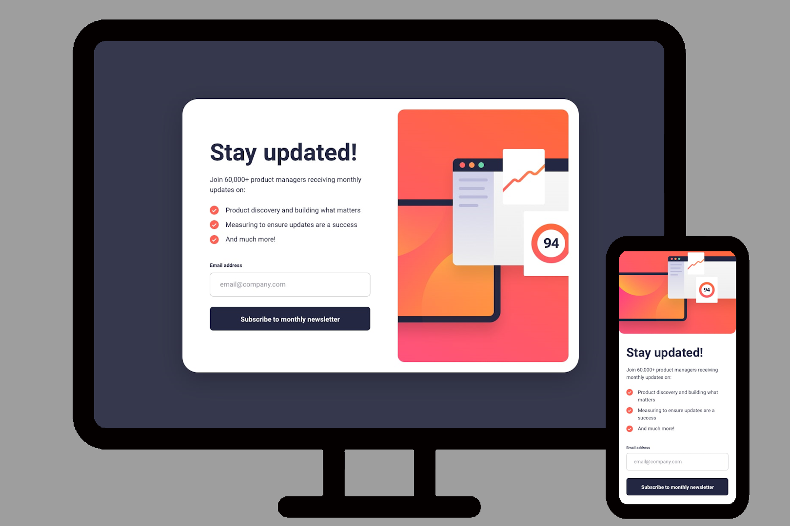

# Frontend Mentor - Newsletter sign up with success message

[Frontend Mentor](https://www.frontendmentor.io) challenges help you improve your coding skills by building realistic projects.

### Links

- Solution URL: [Solution](https://mthsimao.github.io/newsletter-project)

### 🔨 Tools

- [Html](https://developer.mozilla.org/pt-BR/docs/Web/HTML)
- [Css](https://developer.mozilla.org/pt-BR/docs/Web/CSS)
- [JavaScript](https://developer.mozilla.org/pt-BR/docs/Web/JavaScript)

## Author

- My portfolio - <a href="https://mthsimao.github.io/portfolio" target="_blank">Matheus Simão</a>
- Frontend Mentor - <a href="https://www.frontendmentor.io/profile/mthsimao" target="_blank"> mthsimao</a>
